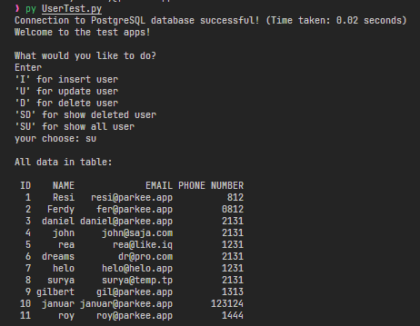

# Simple CRUD Python3 with Pandas and PostgreSQL Database

A simple app for re testing my knowlegde of python.

Req :
- Python3
- pip -> for installing modules
- pandas Module, psycopg2 module
- PostgreSQL database, you can run it on 10 or 12
- SQL IDE like, dbeaver or DataGrip, u can also use Pgadmin3 if you want
- databse is simple, just name email and phone number

How to run?
--> py UserTest.py

* im not hard deleting of running query on this app, im just soft deleting the data -> update deleted_at of the ID

